# MStack: Open Source Maintainer Automation for Claude Code

[](LICENSE)
[](CHANGELOG.md)
[](CONTRIBUTING.md)

<p align="center">
  
</p>

Open source maintainer automation skills for Claude Code.

An OSS maintainer with 50 unread issues spends 80% of their time on grunt work: labeling, finding duplicates, screening spam PRs, drafting responses. MStack compresses that to near-zero. The judgment stays with the maintainer.

## Skills

| Skill | What it does | Say this to Claude |
|-------|-------------|-------------------|
| **maintain** | Full pipeline: triage + review + respond + health | "run mstack maintain" |
| **triage** | Categorize issues, detect duplicates, flag bots | "triage the issues in this repo" |
| **review-prs** | Pre-screen PRs: security, tests, quality, CI | "review the open PRs" |
| **respond** | Draft tone-matched responses for issues and PRs | "draft responses for open issues" |
| **health** | Repo health report: stale, CI, dependencies | "run a health check on this repo" |
| **mstack-release** | Changelog + version bump + GitHub release | "cut a new release" |
| **mstack-setup** | Configure MStack for this repo | "setup mstack for this repo" |

## Install (30 seconds)

```bash
git clone --single-branch --depth 1 https://github.com/Abhilash-003/mstack.git
cd mstack && ./setup
```

The setup script symlinks all skills into `~/.claude/skills/` so Claude Code can discover and invoke them. Works regardless of where you clone the repo.

## Quick Start

MStack skills are invoked through natural language in Claude Code. Just describe what you want:

```
"run the full maintenance pipeline on this repo"
"triage the open issues"
"review open pull requests"  
"draft responses for unanswered issues"
"give me a health report for this repo"
"cut a new release"
```

You can also be specific:

```
"review PR #42"
"respond to issues #17 and #23"
```

**First time?** Start with:
```
"setup mstack for this repo"
```

## The Maintenance Pipeline

```
TRIAGE → REVIEW → RESPOND → HEALTH
  ↑          ↑        ↑        ↑
  └──────────┴────────┴────────┘
         human checkpoints
```

Every phase transition is a checkpoint. You approve the triage actions before any labels are applied. You review each PR analysis before a comment is posted. You read each draft response before it goes live. The pipeline is assistive, not autonomous.

## How It Works

Each skill is a SKILL.md file that Claude Code reads and follows. No backend, no database, no custom agents. Logs and reports live in `.mstack/` at your project root. Global config lives in `~/.mstack/`.

All GitHub actions happen through the `gh` CLI — which you're already authenticated with. No Personal Access Token, no OAuth app, no secret management.

### Architecture

- **Pure SKILL.md files** — no Express, no React, no Postgres. Claude Code IS the runtime.
- **Logs at project root** — structured JSONL in `.mstack/logs/`, health reports in `.mstack/reports/`.
- **gh CLI for everything** — already authenticated, no extra credentials needed.
- **Two-phase install** — offline bootstrap (`./setup`) + interactive per-repo setup (say "setup mstack").
- **Human-in-the-loop** — every label, comment, close, tag, and push requires explicit approval.

See [ARCHITECTURE.md](ARCHITECTURE.md) for the full design rationale.

## Requirements

- **Claude Code** (or any Claude Code-compatible agent)
- **gh CLI** (`brew install gh` or [cli.github.com](https://cli.github.com)) — must be authenticated
- **git**

## Project State

Internal plumbing lives in `.mstack/` at your project root.

```
your-repo/
└── .mstack/
    ├── config.yml                      # Repo identity and behavior config
    ├── logs/
    │   ├── triage-2026-04-13.jsonl     # Issue analysis (append-only)
    │   ├── review-2026-04-13.jsonl     # PR analysis (append-only)
    │   └── maintain-2026-04-13.json    # Session state
    └── reports/
        └── 2026-04-13-health.md        # Health check report
```

Add `.mstack/` to `.gitignore` to keep logs local (MStack will offer to do this during setup).

## Configuration

Global config at `~/.mstack/config.yaml`:

```bash
bin/mstack-config get stale_days         # read: 30
bin/mstack-config set stale_days 60      # write
bin/mstack-config list                   # show all
```

Per-repo config at `.mstack/config.yml` — written by mstack-setup, editable directly.

Key settings:

| Key | Default | Effect |
|-----|---------|--------|
| `detect_duplicates` | `true` | Semantic duplicate detection during triage |
| `detect_bots` | `true` | Bot/spam flagging in triage and PR review |
| `stale_days` | `30` | Days before an issue or PR is considered stale |
| `require_tests` | `true` | Flag PRs that change source without adding tests |
| `security_scan` | `true` | Scan PR diffs for hardcoded secrets and injection risks |
| `max_files_warn` | `50` | Warn when a PR touches more than N files |
| `changelog_format` | `keep-a-changelog` | Changelog style for release skill |
| `version_scheme` | `semver` | Version bump strategy |

## Comparison

| | MStack | GitHub Agentic Workflows | PR-Agent | Manual |
|--|--------|--------------------------|----------|--------|
| Scope | Full maintenance pipeline | CI automation only | PR review only | Everything |
| Infrastructure | None (SKILL.md files) | GitHub Actions runners | Hosted service or self-host | None |
| Human approval | Every action | Configurable, often none | Optional | Always |
| Issue triage | Yes | No | No | Manual |
| Response drafting | Yes (tone-matched) | No | No | Manual |
| Repo health reports | Yes | No | No | Manual |
| Release automation | Yes | Partial | No | Manual |
| Auth required | gh CLI (existing) | GitHub Actions token | API key | None |
| Install | 30 seconds | Per-workflow | Complex | N/A |

## Documentation

- [README.md](README.md) — this file
- [ARCHITECTURE.md](ARCHITECTURE.md) — why MStack is built this way
- [CLAUDE.md](CLAUDE.md) — development commands, project structure, config reference
- [CONTRIBUTING.md](CONTRIBUTING.md) — how to add skills and contribute
- [CHANGELOG.md](CHANGELOG.md) — release notes

## License

MIT
